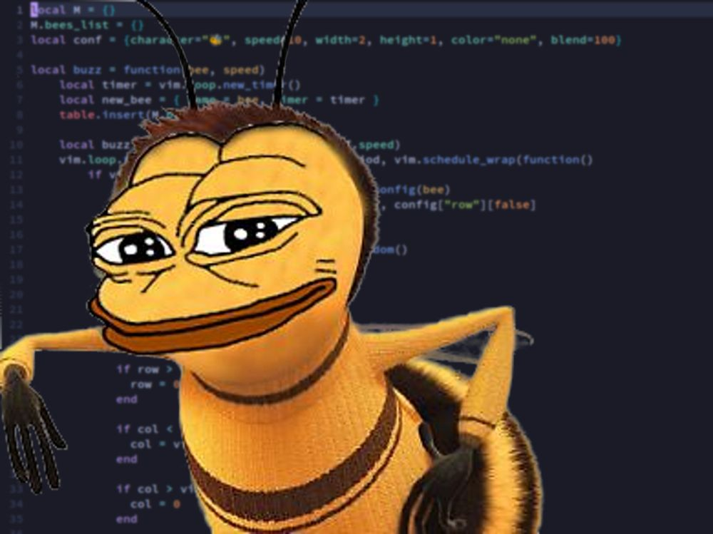

# bee.nvim

### Overview

A superior fork that respects the **bee**.

No more 'cooking' cute animals, no more cringe 2020 'amogus' references for braindead zoom zooms. Just pure honey 🍯.




### Installation and Configuration

```lua
{
    'tristan-harris/bee.nvim',
    config = function()
        vim.keymap.set('n', '<leader>db', function() require("bee").summon() end, {desc="Summon [b]ee"})
        vim.keymap.set('n', '<leader>dh', function() require("bee").fly_home() end, {desc="Send bee [h]ome"}) -- h for home/hive
        vim.keymap.set('n', '<leader>da', function() require("bee").all_fly_home() end, {desc="Send [a]ll bees home"})
    end
}
```

You can modify the bee's buzziness in the `config` function like so.

```lua
-- two buzzes per second
require("bee").summon(2)
```
